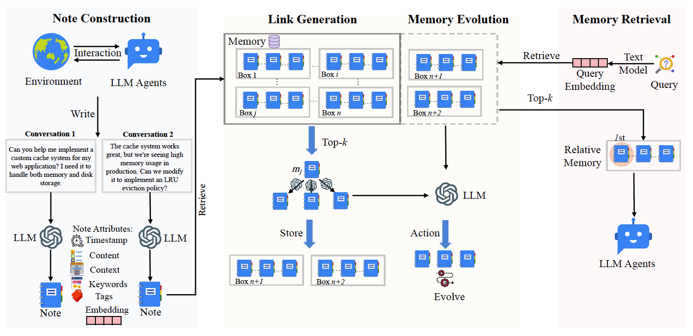

+++
title = "A-MEM: Agentic Memory for LLM Agents"
date = 2026-04-14T14:30:00+08:00
draft = false
slug = "a-mem-agentic-memory-for-llm-agents"
summary = "A-MEM 将长期记忆建成可自组织、可链接、可演化的 note network，用代理式记忆替代静态写入与检索流程。"
tags = ["LLM-based Agent", "Memory", "Graph"]
categories = ["论文笔记"]
+++

<div class="paper-hero">
  
  <div class="paper-highlight">
    <strong>Highlight</strong>
    <p>核心的记忆机制就是记忆存储的设计以及记忆检索两个方面。记忆存储结构基于图，不过是基于笔记本的概念创建记忆节点，然后link之前的记忆节点，记忆基于link的记忆节点重新更新对应的内容进行进化。本文的原发复现过程中，这里的是将所有的对话历史一次性构建记忆库，一次性构建记忆库内容重视逐步构建记忆笔记的，涵盖一个记忆进化过程。</p>
  </div>
</div>

## 一、基本信息

- 题目：A-MEM: Agentic Memory for LLM Agents
- 年份：2025
- 会议 / 期刊：NeurIPS
- 单位：Rutgers University
- 论文链接：[https://arxiv.org/abs/2502.12110](https://arxiv.org/abs/2502.12110)
- 代码链接：[https://github.com/WujiangXu/AgenticMemory](https://github.com/WujiangXu/AgenticMemory)

## 二、Motivation

### 2.1 任务定义

- 任务目标：为 LLM Agent 设计一个支持长期交互的通用记忆系统。
- 任务输入：Agent 与环境的历史交互内容，以及当前查询。
- 任务输出：基于当前查询和相关历史内容生成的当轮回答。

### 2.2 研究问题

- 现有记忆系统通常只支持预定义的写入、检索和存储结构，灵活性差。
- 即便引入图数据库，很多方法依然依赖静态 schema 和固定关系，难以适应开放环境中的新知识。
- 作者要回答的问题是：能否让记忆系统像 agent 一样主动组织记忆，而不是只做被动存储与召回。

## 三、方法

### 3.1 整体流程

1. Agent 与环境交互后，系统将一段新经验写成一个结构化 note。
2. 对这个新 note 生成上下文描述、关键词、标签和 embedding。
3. 用 embedding 从历史记忆中检索 top-k 相关 note。
4. 让 LLM 判断新旧记忆之间是否应该建立链接，形成“盒子 / box”式关联结构。
5. 再根据新记忆反向更新旧记忆的上下文、关键词与标签，完成 memory evolution。
6. 检索阶段先找与当前 query 最相关的 note，再联动取出同 box 中的 relative memory 供 agent 使用。

### 3.2 关键模块

- Note Construction：把原始交互转成结构化 note，字段包括内容、时间戳、关键词、标签、上下文描述、embedding 和 links。
- Link Generation：先做相似度召回，再让 LLM 判断哪些历史记忆应该与当前记忆建立连接。
- Memory Evolution：新记忆写入后，不只新增节点，还会触发旧记忆的描述与属性更新。
- Memory Retrieval：检索当前 query 对应的核心记忆，并把相关 linked memory 一起带出来。

### 3.3 创新技术

- 借鉴 Zettelkasten 方法，把记忆组织成原子化 note 与动态链接网络，而不是固定表结构。
- 把“连边”和“演化”都交给 LLM 决策，使记忆结构能随着新经验持续重组。
- 检索的不只是语义最相近的一条记忆，而是围绕相关 note 进一步展开相对记忆，支持多跳推理。

## 四、实验分析

### 4.1 数据集

- LoCoMo：长程对话问答数据集，平均对话约 9K token，最多跨 35 个 session，包含 single-hop、multi-hop、temporal、open-domain、adversarial 等问题类型。
- DialSim：来源于长程多方对话场景，覆盖 Friends、The Big Bang Theory、The Office 等剧集，适合测试长程对话记忆能力。

### 4.2 对比基线

- LoCoMo
- ReadAgent
- MemoryBank
- MemGPT

### 4.3 评价指标

- 主指标：F1、BLEU-1
- 补充指标：ROUGE-L、ROUGE-2、METEOR、SBERT Similarity

### 4.4 实验目的与结论

- 实验 1：整体效果对比。目的是验证 A-MEM 作为长期记忆系统，是否能在完整任务上稳定优于现有方法。结论是 A-MEM 在 LoCoMo 和 DialSim 上整体表现更强，尤其在 Multi-Hop 这类需要跨记忆推理的任务上优势最明显。
- 实验 2：不同模型下的泛化效果。目的是看 A-MEM 是否只对某一类基础模型有效，还是能在 GPT 系模型和开源模型上都带来收益。结论是它在不同底座下都能提升表现，说明方法本身具有较好的通用性，而不是仅依赖特定模型能力。
- 实验 3：组件消融。目的是验证 Link Generation 和 Memory Evolution 这两个核心组件是否真的必要。结论是去掉任一组件后性能都会下降，同时去掉两者下降更明显，说明“建立链接”和“记忆演化”共同支撑了系统效果。
- 实验 4：效率评估。目的是判断这种代理式记忆机制是否在效果提升之外还具备实际可用性。结论是 A-MEM 在 memory operation 上显著减少 token 开销，并保持较快处理速度，说明它不仅更有效，也更节省推理成本。

## 五、Others

```
文章中的评估对于对抗性问题可能存在一定的问题，其次这里的第五类的策略基于的做法是基于选择题实现的，并且本身的评估在这里也存在问题，正确答案应该是未提及到，到时候注意一下这个数据集
```
