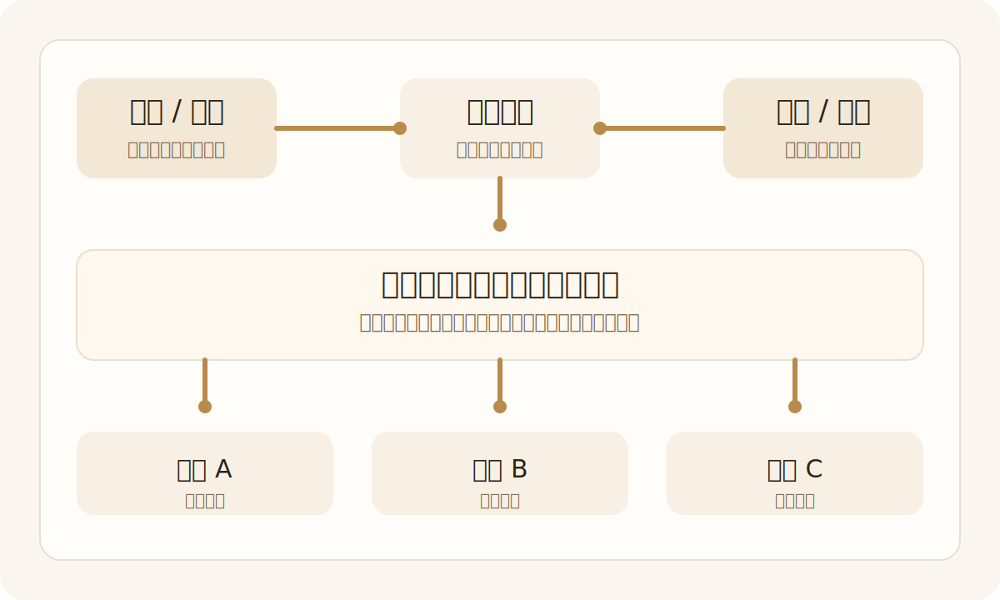

+++
title = "论文笔记模板"
date = 2026-04-13T16:20:00+08:00
draft = false
slug = "paper-note-template"
summary = "一个适合长期维护的论文分享模板：先用架构图和一句话导读建立全局理解，再按动机、方法和实验分析展开。"
tags = ["论文笔记", "模板", "科研"]
categories = ["工具"]
+++

  <figure class="paper-hero-figure">
    
    <figcaption>把论文最关键的结构图放在这里。优先选主图、总览图，或者你自己重绘的流程图。</figcaption>
  </figure>
  

    一句话导读：这篇论文围绕什么核心问题展开，最关键的方法设计是什么，最终最值得记住的结论又是什么。
  

## 一、基本信息

  
题目
在这里填写论文全称

  
年份
2026

  
会议 / 期刊
CVPR / ICCV / NeurIPS / ACL / TPAMI ...

  
机构
第一署名单位

  
论文链接
<a href="https://arxiv.org/">https://arxiv.org/</a>

  
代码链接
<a href="https://github.com/">https://github.com/</a>

## 二、Motivation

### 2.1 任务定义

- 任务输入是什么。
- 任务输出是什么。
- 论文针对的应用场景或任务边界是什么。

### 2.2 研究问题

- 这篇论文真正要解决的问题是什么。
- 现有方法卡在哪里。
- 作者为什么认为这个问题值得重新处理。

## 三、方法

### 3.1 整体流程

按“输入 -> 处理 -> 输出”的顺序，概括完整方法流程。

1. 第一步做什么。
2. 第二步做什么。
3. 第三步做什么。

### 3.2 关键模块

- 模块 1：负责什么。
- 模块 2：负责什么。
- 模块 3：负责什么。

### 3.3 创新技术

- 创新点 1：
- 创新点 2：
- 创新点 3：

## 四、实验分析

### 4.1 数据集

- 数据集 1：
- 数据集 2：

### 4.2 对比基线

- 基线 1：
- 基线 2：
- 基线 3：

### 4.3 评价指标

- 指标 1：
- 指标 2：
- 指标 3：

### 4.4 实验问题与结果

- 主要结果：
- 围绕研究问题，还应该关注哪些补充结果：
- 消融实验 / 可视化 / 鲁棒性实验分别说明了什么：

## 五、我的判断

### 5.1 贡献总结

- 这篇论文最核心的贡献是什么。
- 哪个技术点最值得记住。

### 5.2 局限与问题

- 可能的局限：
- 还未回答的问题：

### 5.3 我的启发

- 对自己的研究或写作有什么启发。
- 是否值得后续复现或继续跟进。

## 六、后续行动

- [ ] 复现核心模块
- [ ] 补读引用文献
- [ ] 纳入 related work
- [ ] 整理到长期研究路线图
